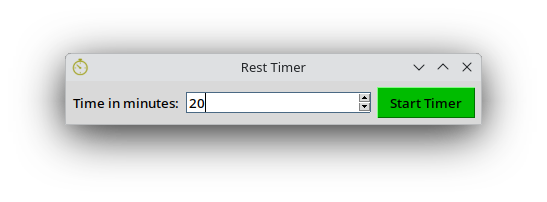

# rest-timer

This is a simple and small but useful GUI application that notifies you to give your eyes a rest after the time you specify.
You just need to enter the time in minutes and click the start button. The default is 20 minutes.

